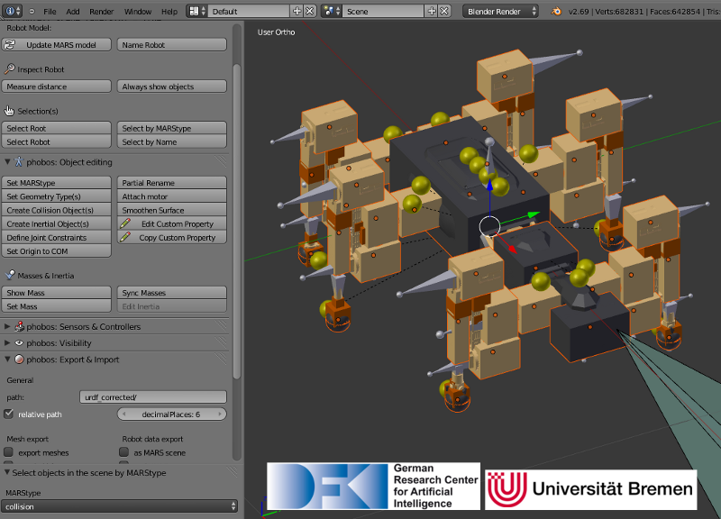

Phobos
======

Phobos is an add-on for the open-source 3D modeling software [Blender](http://www.blender.org). It uses Blender's powerful Python scripting API to extend Blender with GUI-supported tools that simplify the creation and modification of robot models for use in real-time simulations such as MARS or Gazebo. It is both possible to create robots from scratch as well as to derive them from exported CAD data - and Phobos allows to export completed models in formats such as URDF (widely used in ROS) and SMURF (the DFKI's versatile robot data format based on URDF). Meshes can currently be exported as .stl, Wavefront (.obj) and binary Wavefront (.bobj) for quicker importing into the MARS Simulation.

## Robot representation
Phobos makes use of Blender’s hierarchical object graph and its bone objects. These objects, normally used for animating 3D characters, allow to store 3D coordinate systems and apply constraints to their movements, for instance to restrict the movement of an object to a certain range on a specific axis. This allows to replicate the links and joints defined in a URDF model and together with the hierarchical tree of parent and child objects, the complete, branching kinematic chain of a robot can be represented.
By attaching meshes or primitives to the bones, Phobos allows to add visual and collision objects to a model. Additional objects allow storing further information, e.g. centers of mass of each part of a robot, thus refining the physical representation. Sensor objects can be added to correctly place and orient devices such as laser scanners, cameras or contact sensors. Making use of Blender's custom object properties, any necessary information can be added to the model, from inertia tensors to opening angels of cameras.

*Model of the SpaceClimber robot in Blender, next to the Phobos toolbar displayed on the left.*

## Features

- Model error checking
- Batch editing of object properties
- Measurements (e.g. distance of parts, sum of masses)
- Synchronization of mass information between different layers
- Auto-generation of collision objects
- Auto-generation of simplified inertia; combination of manually defined precise inertia
- Online definition and testing of joint constraints
- Sensor attachment to single or multiple parts of a robot
- Import and export of URDF, SMURF and other formats
- Exporting with defined floating point precision
- Growing number of tutorials

## License

Phobos is distributed under the [GNU Lesser General Public License](https://www.gnu.org/licenses/lgpl.html).
