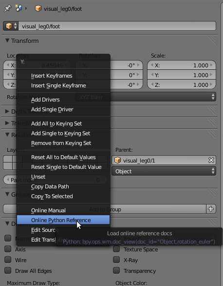
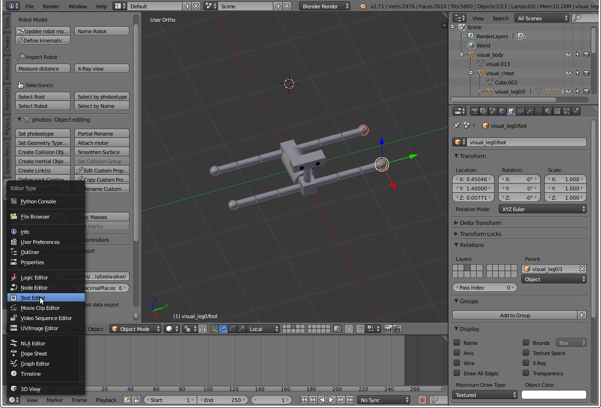
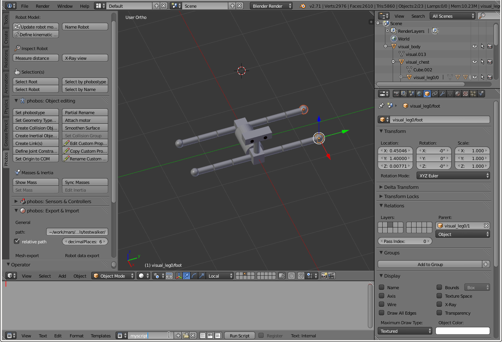
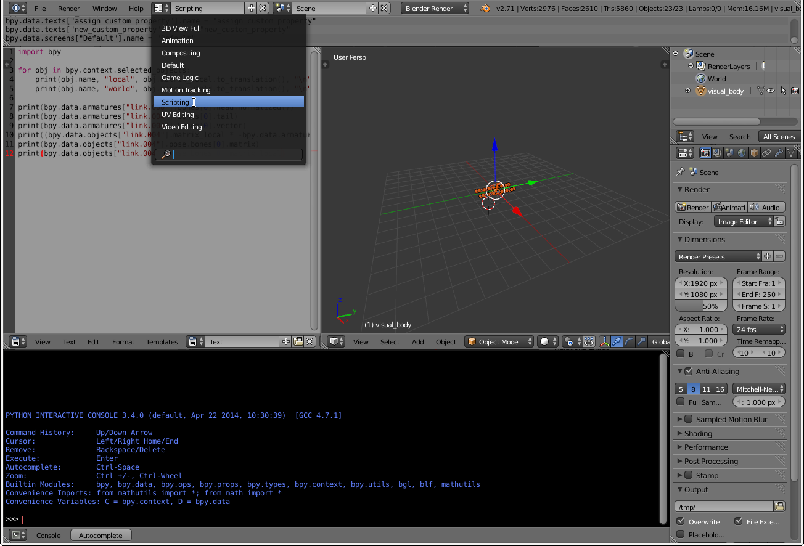
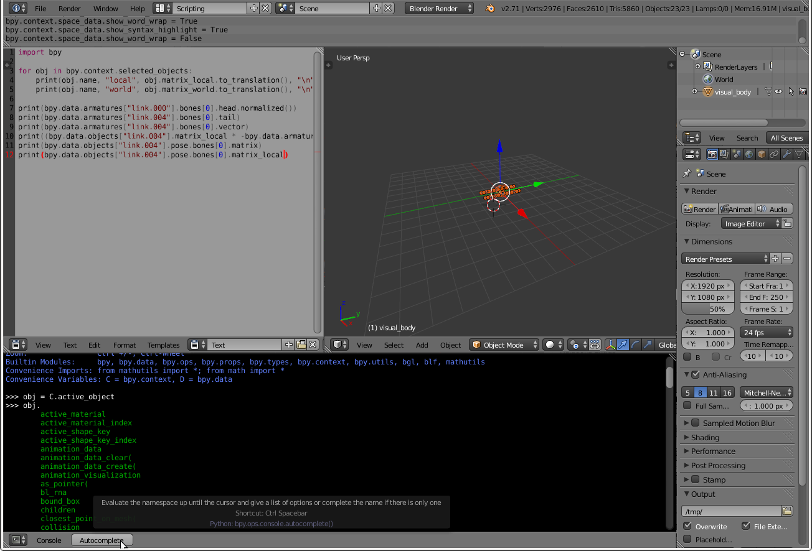

Blender
=======

## Getting started

It is way beyond the scope of this documentation to give you an introduction to Blender, especially since more knowledgable people have done so in other places, such as the [manual on Blender wiki](http://wiki.blender.org/index.php/Doc:2.6/Manual). First, try to get [started with Blender's GUI](http://wiki.blender.org/index.php/Doc:2.6/Manual#Starting) and then have a look at how to [work with objects](http://wiki.blender.org/index.php/Doc:2.6/Manual#Modeling). Don't worry, Blender is a really powerful piece of software and can seem daunting for a beginner, but the functions you really need to know to use it for your robot modelling purposes are comparably limited.

The best piece of advice we can give you as a Blender beginner: **RMB** on anything you don't understand. Chances are there will be a pop-up menu with hyperlinks to both the user manual and the API documentation (not in the 3D editing window, though, there **RMB** is what you would normally expect **LMB** to be).

*Let's see what this Y field in Rotation is about, either at the Blender Manual or its Python API reference.*

## Blender scripting

Blender has a great Python scripting API that Phobos is based on. However, you need not limit yourself to using our pre-defined [operators](operators.md), but you can create your own scripts in Blender and save them together with your model, or punch in a few commands in a python terminal.

*You can open a text editor in Blender...*

*Hit the '+' button to create a new text file, name it as you fancy and start editing. A Blender file can contain many such user-created text files and they can also be loaded and saved from/to disc, allowing to import scripts that are often used or store robot-specific scripts for later use together with the robot.*

*When this simple script is run, we create a new custom property of the selected objects, in the same way as one would create new entries to a Python dictionary. Note that we've switched on line numbers and syntax highlighting in the editor (next to 'Run Script' button).*

*You can also switch the overall GUI of Blender to the 'Scripting' layout, thus opening a text editor and python terminal by default.*

*Blender's python terminal is quite powerful, providing an awesome autocomplete function, so you can easily access all properties of the objects that make up your robot.*

We are using short scripts made for the occasion all the time when editing our models and it can especially speed up repetitive tasks. If you're using a script again and again on your robots, you may even want to build an operator for it and contribute it to Phobos.

## Blender Insider Infos

### Blender Transformation Matrices

In Blender, every object possesses four different transformation matrices to save its current location, rotation and scale in space. These are:

- matrix_basis
- matrix_local
- matrix_world
- matrix_parent_inverse

These matrices make the parent-child relationships possible that objects can be structurally ordered with in Blender. Thus very different behavior can be observed for these matrices depending on whether they belong to a *global* or *child* object. Global objects are objects which do not have a parent, and their location, rotation and scale are fully defined in relation to the world, thus their matrix_basis, matrix_local and matrix_world are all equal. As they possess no parent, the parent inverse matrix is the identity transform (or the last matrix_parent_inverse they had before they were un-parented from some object, however the matrix is ignored). In objects which are children of other objects, i.e., which have a parent, the three matrices serve different functions, as outlined below.

#### matrix_basis

matrix_basis is the transformation of an object *in its own coordinate space*. It represents the transform that is displayed in Blender's "Transform" values in the sidebar and object properties. These values are often a point of confusion, because the matrix_basis does *not* necessarily refer to the object's actual position and orientation in space (the exception being global objects, where it always does). Instead, this is the global transform the object would possess *if it was NOT parented* to another object. For instance, if you move an object in X direction by 1.0 units, the vector (X:1, Y:0, Z:0) will be displayed in the sidebar even if you afterwards parent that object to another object and move that parent object around in your Blender scene.

#### matrix_local

The local matrix defines the transformation from the parent world transform to the child world transform. This means that if the local matrix of a child is applied to its basis, it would reside at its parent's origin. Likewise, if you move an object in relation to its parent, this matrix will get updated.

#### matrix_world

This matrix is the absolute transform of the object in the world (and sometimes you wish this was the one displayed in the sidebar instead of the matrix_basis). This is the location, orientation and scale at which the object is displayed in blender.

#### matrix_parent_inverse

The parent inverse matrix is set at the time of parenting and *never changes afterwards*, no matter what transformations are applied to the parent or the child (in fact, it doesn't even change after a parent-child relationship is cancelled and is simply ignored by Blender until the object becomes a child again, at which point it is simply overwritten). It is the transformation which, if applied to the child, reverses the change of the origin of the child's coordinate system that resulted from establishing the parent-child relationship. It is thus equal to the inverse of the parent's *world transform at the time of parenting*. This last point is important! As the parent could be a child of another object, the local and basis transforms would not reflect the change of origin of the parent, thus the world transform has to be used to derive the parent inverse.

#### Summary

- matrix_basis: the object's "own" transform in its own coordinate system
- matrix_local: the transform which brings an object from its parent's origin to its position in the world
- matrix_world: the absolute transform of the object with respect to the world
- matrix_parent_inverse: the inverse of the parent's world transform at time of parenting

#### Utility function

While Blender does not readily display all these matrices, Phobos has a function for doing so: `utility.printMatrices`, which you can run from Blender's terminal or in a script. 
