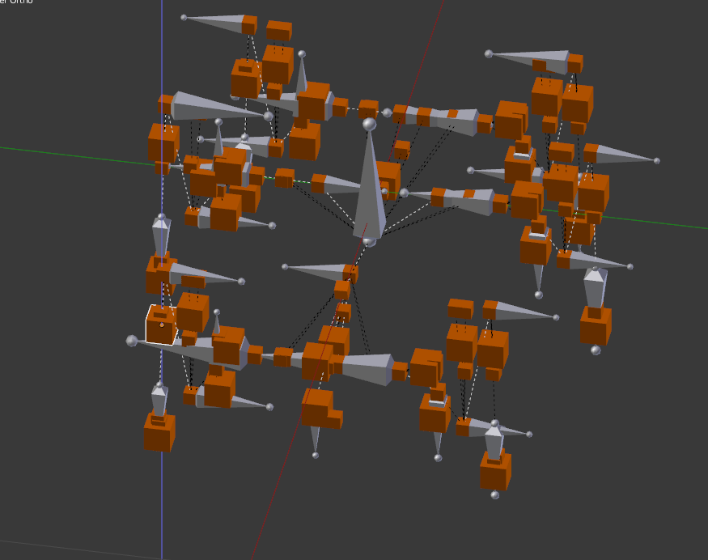

Editing a model
===============

If you run into problems following the information provided here, maybe a look at the [operators documentation](operators.md) might help.

## Phobos toolbar

The Phobos toolbar can be found on the *Tools* toolbar on the left of the 3D view. If it's not visible, hit **T** to make it appear. One of the tabs should print *Phobos*, which is the toolbar with Phobos' operators.
It consists of five categories, holding operators with differrent focuses. You can find an overview on the [operators](operators.md) page. 

## Layers

A Phobos robot model in Blender is typically arranged on multiple layers, like so:

*Model of the DFKI's SpaceClimber robot in Blender.*

Phobos has a default setting to arrange objects of different types on different layers. This is specified as

Layer  | Type
------ | -------------
0 | links (joints)
1 | inertials
2 | visuals
3 | collisions
4 | sensors / controllers

and will determine on which layers objects are placed upon import or created by various operators. While you can arrange your model on layers as you wish, this might interfer with the function of some operators in a way hardly predictable. We are planning to give users more flexibility in their layer management in future versions.
Nevertheless, if your model is nicely layered by types, it's possible to isolate certain types of objects by clicking on the layers below the viewing window (hold SHIFT down to select multiple layers). To move selected objects to a different layer, hit **M**. 

## Links & Joints

Note: Phobos uses Blender's armatures and bones for representing the kinematic structure of a robot. These are objects designed for animating characters in 3D and thus come with some baggage we are not using in Phobos (yet). If you're having problems to follow this section, consider a quick read in the [Blender manual](http://wiki.blender.org/index.php/Doc:2.6/Manual/Rigging/Armatures).

Links are represented in Blender as armatures containing one single bone. At the same time, these objects represent the parent joints of the associated links. In a way it could be said that the armature represents the link whereas the bone represents the joint. This is because armature and bone have their own coordinate systems, which coincide when an armature is newly created, but can be changed later. This is important as URDF allows to specify the axis of a joint independent of the transform the joint defines to get from its parent to its child link. By changing the orientation of the bone in relation to the armature, the axis orientation in relation to the joint space can be accompanied. This is especially so as the joint axis in Phobos equals the long axis of a bone, making it possible to visualize the axes in a model.

You can manually create an armature using the 'Create' toolbar and set its *phobostype* to *link*, or transform existing armatures into links by setting the type. The easiest way to create new links however is the *Create link(s)* operator in the *Object editing* category of Phobos' tools. This will allow you to either create one single link at the position of the 3D cursor or multiple links at the positions (and in the orientations) of the selected objects.

Links can be connected - with joints - by setting up parent-child relationships between them. Blender knows a number of different parenting types depending on the objects to be related. For Phobos, it is essential that you always use the *Bone Relative* parenting type. The reason for this is the following: As stated before, the axis of rotation of a joint is determined by the orientation of a bone. However Blender treats bones as essentially two objects in one: a *pose bone* and an *edit bone*. You might be thinking "Come on, not ANOTHER object!", but this is actually a pretty cool feature. It allows to define a *rest position* of an armature that equals the transform of the edit bones, and a *pose position* that defines an actual pose. Consequently, if you're turning the pose bone, all objects attached to it will turn with it. Not so with the edit bone: If this is changed, you simply change the bone itself and the relations to all attached objects are altered by Blender so they can remain where they are. This, however, only works in the *Bone Relative* parenting mode. Consequently, if you wish to change the rotation axis of a joint after your model has been completed, you simply change the edit bone and that's that - the bone's children will NOT get moved and the rest of your model stays intact. This is pretty handy when constantly having to adapt your robot model to ongoing mechanical design.
When an armature is selected in blender, you can switch from "Object Mode" to "Edit Mode" or "Pose Mode" in the toolbar below the 3D view, allowing you to change the edit bone and pose bone.

----

Hitting **CTRL** + **P** will show a context menu for parenting which presents the available parenting types, with the one we want to choose at the very bottom.
Note that the two types *Bone* and *Bone Relative* are not discriminated between in the *Relations* section of the properties panel on the right. Thus the only way of making sure two objects use the correct parenting type is to parent them again to one another with the correct type.

## Visual & collision objects

Visual and [collision](collisions.md) objects are much simpler than links and joints. They are mere 3D-objects containing meshes. Like they were meant to in Blender, you can assign colored and textured materials to visual objects and essentially get a WYSIWYG experience with your model. You can also assign materials to collision objects if you wish, which often makes it easier to identify which visuals they relate to.
There still remain some important details, though. While you can create cubes and spheres etc. in Blender, Blender only keeps track of their geometrical shape upon creation and then forgets about it: all such objects are essentially meshes built from vertices. In order to write the correct geometry type when exporting your robot, we need to assign custom properties to the objects defining their type. This is specified in the custom property `geometry/*`, where `*` stands for one of the geometric types defined in URDF ('box', 'sphere'...). 

## Inertial objects

If an inertial has to be moved - this is the case if it is not created at the COM of a link - it can be moved simply as any other object in Blender would be moved, by selecting it, hitting **G** and then moving it around. Movement can be restricted to certain axes by hitting **X**, **Y** or **Z** after hitting **G** respectively. You can even type in a certain distance, like so: **G X 0.3** will move the object 0.3 units in X direction. If the axes keys are hit twice, Blender will choose the axes according to the object's local space rather than global space.

## Sensors

Sensors are currently rudimentarily supported, allowing for legacy sensor types of the MARS scene format to be used. No sensor-related data is exported to URDF and there are hardly any pre-defined custom properties for the different sensor types. Thus it falls to the user to set the custom properties according to the requirements. This issue however is top of the list for future releases of Phobos.

