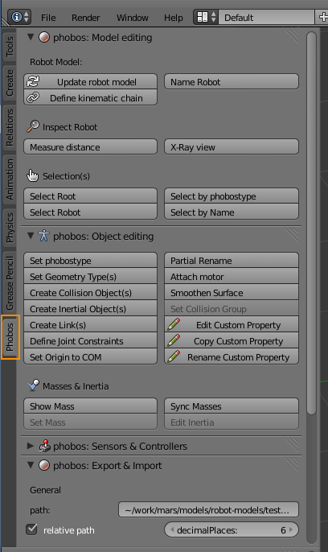

Installing Phobos {#phobos_installation}
===================

This document aims to provide an instruction to set up Blender and install the Phobos Add-On.

## Blender installation

### Linux
The simplest way to install blender in a linux environment is to use your favourite package manager. In Ubuntu for example just type `apt-get install blender` into a terminal with root permissions. However, you may want to check which version of Blender is available in the repository for your linux version. Phobos has been developed for Blender versions >= 2.69 and works best with 2.71. Some functionality might not work properly on earlier versions. Thus it might be necessary that you get the latest Blender version yourself from [Blender's website](http://www.blender.org) as a tarball. Extract the archive and place it where you want blender to be installed. Please notice that you have to have *glibc* installed on your system to run blender properly.

### Windows
Installing blender on windows is as simple as downloading the installer from [Blender's website](http://www.blender.org) and run it. Alternatively, you can download a zip file and extract it to your preferred location.

## Phobos installation

### Installation via installscript (Linux & Mac)
Using the installscript is the most convenient way to install Phobos for developers, as it allows to update the plugin in Blender to test your latest changes.

#### YAML
Phobos uses the YAML language for some of its output formats. As Blender uses Python 3, this means that if you want it to use the most current package version, you need to install [python3](https://www.python.org/) and the python module [yaml](http://www.yaml.org/) on your machine. Most of the major distributions offer packages for yaml (in Ubuntu for example the package is named `python3-yaml`). You can also use [pip](https://pypi.python.org/pypi/pip) to install yaml into your python environment. However, we distribute the yaml package with Phobos (under its own license, of course), and may update that version occasionally if there are important bugfixes on the module (lately, there haven't been).

#### Getting Phobos

There are two options to get phobos: cloning the repository or downloading the repository as a zip. The first option, naturally, is the best for developers. To clone the phobos [git repository](https://github.com/rock-simulation/phobos), run `git clone https://github.com/rock-simulation/phobos.git` in a terminal and phobos should be checked out in a subfolder called *phobos*. For that you of course need to have [git](http://git-scm.com/) installed. Alternatively, you can download a zip file directly from our GitHub page and extract it somewhere. Once you have phobos on your harddrive, navigate to its folder, run the shell script *install_phobos.sh* and follow the instructions on your terminal window.

Important note: the install script will ask you about your version of Blender, as we cannot tell which version you'd like to use with Phobos. This is important as you might have several versions installed on your system (e.g. for backwards-compatibility) and they use different folders for addons. However, this is only asked once and saved for running the installs script again.

### Installation via zip file (any platform)
Blender allows to directly install addons from zip files, however the zip file you can download from GitHub has all its contents in a subfolder called 'phobos' while Blender expects no such subfolder. You can therefore either download the zip, extract it and zip everything within the extracted phobos folder, using this new file for installation, or you can download a stable version of phobos from [here](http://XXXXX "pobos download"). Please note that some new features may be missing from these stable versions.
To install the addon, start blender, open File -> User Preferences, switch to the "Addons" tab and use the *Install from zip file* operation.

### Activating Phobos in Blender

To activate Phobos in Blender, go to Files -> User Preferences -> Addons and search for "Phobos" (it's in the "Development" category). Then activate phobos by ticking the checkbox on the right and make sure you also save your user settings in the lower left corner - this is important, as Blender will otherwise not run Phobos again when you start Blender next time. If blender displays any errors at this point, you might want to check if you got the above steps right.

*Find Phobos in Blender's user preferences*

If everything worked fine you can now find the Phobos toolbar as a tab in the left toolbar panel (if you don't see the panel, hit *T*).

###Troubleshooting

####If you started the install script before yaml was installed...
Go to `~/.config/blender/BLENDERVERSION/scripts/addons/phobos/` and delete the file `yamlpath.conf`. Then you can re-run the install script and everything should work.

