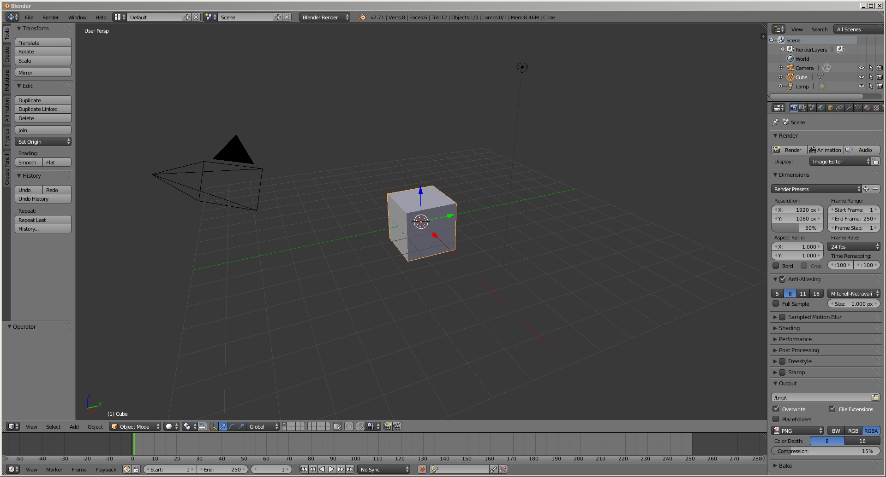
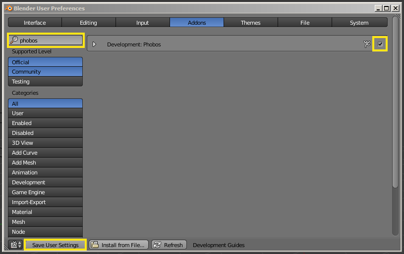
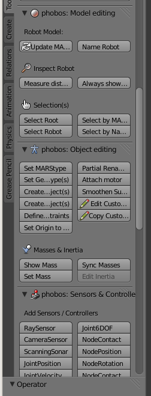
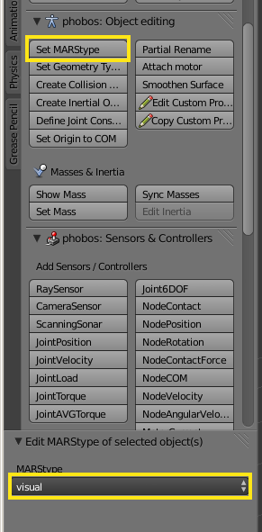
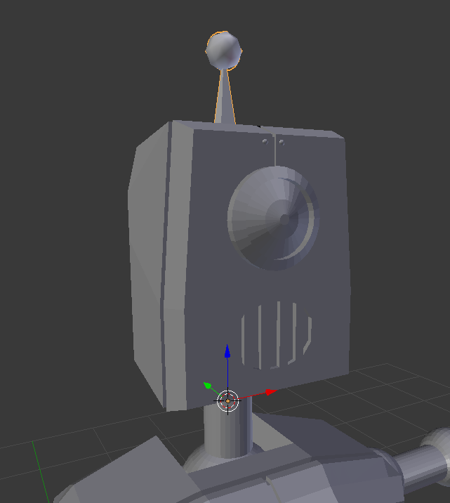
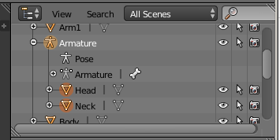
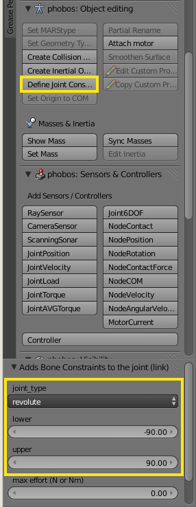

## Phobos Tutorial ##
In this tutorial you will learn how to use the brand new phobos plugin for blender and create your own little robot. You will also learn how to export it to several formats like smurf or urdf.

### Requirements ###
To get through this tutorial you need a working blender setup with the phobos plugin installed. This tutorial uses blender version 2.71, but it will also work fine with 2.69.
<!-- The next requirement will be eliminated, when we add a Step called Blender Basics -->
The tutorial supposes you know the blender basics, so you can navigate in the 3D View and do simple manipulations like scaling and transforming on objects.

### Step 1 - Blender setup ###

Here you can see blenders start screen. If you started blender for the first time you will see a new project containing a camera, a light and a cube. We will handle them later. First we have to make sure that the phobos plugin works properly and is activated.

Go to Files -> User Preferences -> Addons and search for the phobos plugin. Then activate phobos by just clicking the checkbox on the right and make sure you also save your user settings in the lower left corner. If blender displays any errors this tutorial refers to the [phobos installation guide](installation.md "phobos installation guide") to ckeck the correct installation of phobos.

If everything worked fine you can now see the phobos toolbar integrated in the global blender toolbar on the left side. This is all you need to start with the real phobos tutorial!

### Step 2 - Import your visuals ###

Most robots will have some visual components. You can get them in many different ways, like creating them on your own directly in blender. This tutorial uses a bunch of stl files you may obtain from a CAD-Software or something similar. We got our robot, named Bill, from [blendswap](http://www.blendswap.com/ "blendswap"). The whole license can be read in the [license.txt](robot/license.txt "license.txt").
The visuals will be the starting point from where we will create all other components like joints and collsion objects. Before importing them into our scene let us tidy up our workspace by deleting the cube and move light and camera to the last layer available.
Then import your stl files by clicking Files -> Import -> stl. You can of course use the example robot you can find in the robot folder of the documentation. This robot contains just a few meshes and will be very limited in its movements without any further editing, but it will be enough for this tutorial. 

The next step is depending on your import. When you select your robot you may see that all the objects origins are at the worlds origin. We want them to be in the objects center of mass. We can achieve this by using the Object -> Transform -> Origin to Center of Mass operation. Please keep in mind that this operation will only be performed on selected objects! Our next step is to set the proper MARStype of our visuals. We can do this by selecting all visual objects and then using the Set MARStype operation from our phobos toolbar. Choose *visual* for our visual objects. 

### Step 3 - Links and Joints

Links and joints are handled as bones in phobos. The transform property will serve as the link and the bone represents the joint and its constraints. We want to allow Bill to move his head to look around. For that we need to create a new Armature. New objects will be created at the 3D-Cursors position. Using that we can position our new Armature very appropriate by setting the Cursor to the necks origin. Just select the neck and use the Object -> Snap (or Shift+S) -> Cursor to selected. Now we can add our bone by using the Add (Shift+A) -> Armature -> Single Bone. The result should look like this:

Can you see the antenna? Thats our bone. In phobos the z-axis is used to rotate on a joint. Just keep it in mind. The next step is to assign all visual parts that should move with the new bone to it. For that we use the so named *bone related* relationship between objects in blender. Just select all visuals you want to assign to the new link (in our case its the neck and the head). Make sure the last object you select is the bone itself. That makes the bone also the *active* object. Now we can press Strg+P and choose the *bone relative* operation. In the outliner (upper right corner per default) you can see a new hierarchy, where the Armature is the parent of our neck and head. Thats perfect!

The next step is to set the MARStype of our bone. You already know how to do it. Set the MARStype of the bone to *link*. We're almost done. The last part for this new link is to set its constraints. There is also an operation for that in the phobos toolbar named *Define Joint Constraints*. Select it and set the constraints you want. For now we will allow Bill to look from -90° to 90° and set it to a revolute joint type.

To test your result switch from object mode to pose mode (Beneath the 3D Window) if not already done and select your link. Then press *r* to rotate and *z* to rotate around the z-axis only. You can see that you can rotate Bills head within the given bounds.

### Step 4 - Collision objects ###

Another important thing a robot has to have is its physical representation. We can provide this with collision objects. To create a collision object select an object you want a collider for and use the *Create Collision Object* operation from the phobos toolbar. This operation automatically creates a cube that tries to fit the object as tight as possible, but includes all vertices. You can change the collision object type and move and scale it as you want. We just have to scale it a bit down for the moment.

Try to add a collision object for the neck too. You can use a cylinder for that purpose.

### Step 5 - Export your robot ###

Exporting your robot in your favourite file format is very easy with phobos. Just select any component you want to be exported (in most situations you want to export the whole robot) and select the formats you want your robot exported to. Then start the export and you're done.

We hope that tutorial helped you getting started with phobos. Enjoy your now fully visual robot making!
