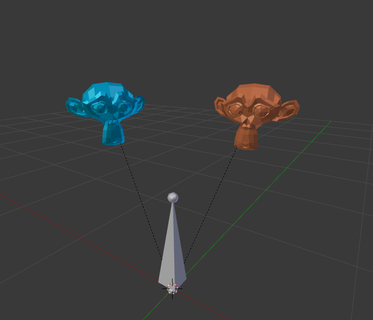
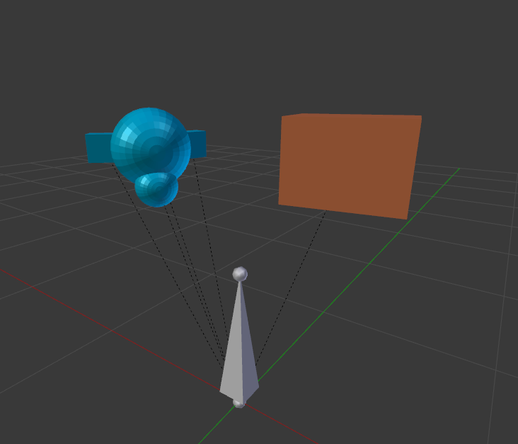
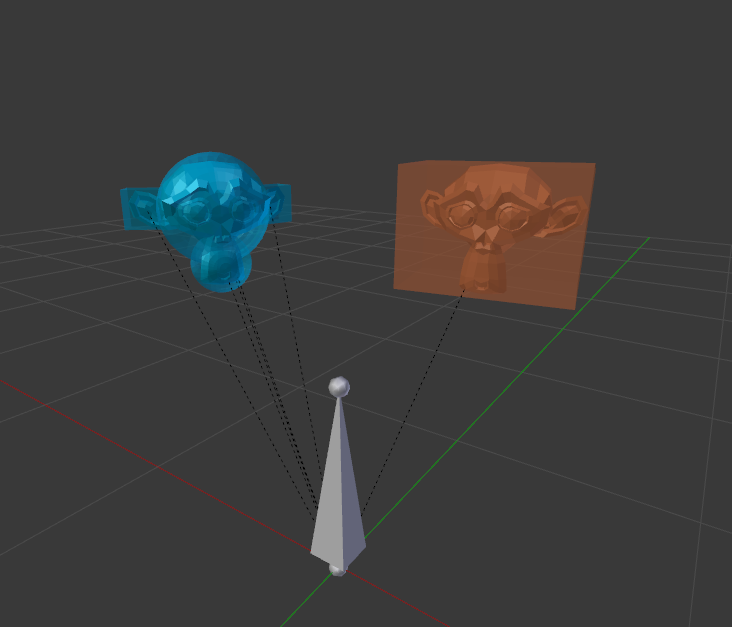
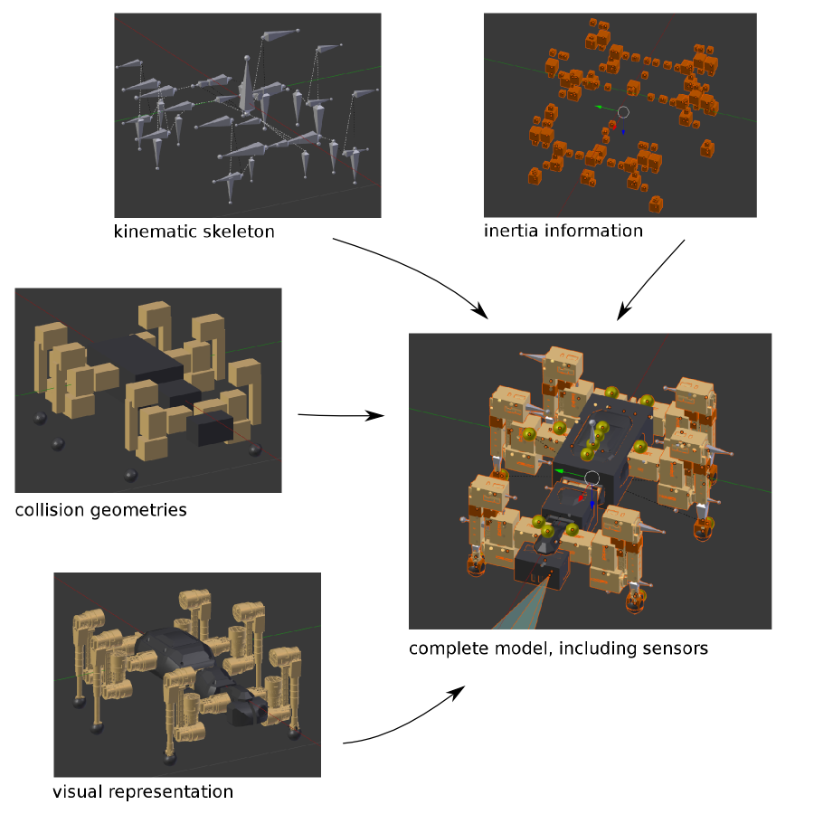

Robot Model
===========

### Structure of robot models

To understand how Phobos represents robots in Blender, it's informative to take a look at URDF first, the format to which the kinematic data of our Phobos models will ultimately be exported. URDF is a very well-documented format and wherever the information provided here may be missing something or not make intuitive sense, you can have a look at URDF's [documentation](http://wiki.ros.org/urdf/XML/model) to get a better idea of how it works.

URDF models consist of *links* defining coordinate frames relative to which objects for visualisation and collision detection can be arranged. These links themselves are placed relative to one another as defined in the accompanying *joints*, one joint connecting two links at a time. Thus a tree is built from these links interconnected by joints, forming a hierarchical, branching kinematic chain (thus the name *link*). Fortunately, Blender also arranges 3D objects in a hierarchy, enabling essentially a WYSIWYG (What-you-see-is-what-you-get) approach when emulating URDF. However, there are some limitations, the most important one being that *links* and *joints* are not represented as separate objects. This is due to the simple fact that Blender objects always contain a transformation relative to their parent object and thus the transformation information of a joint can be incorporated in an object that already represents a *link*.

Such "superlinks" containing their parent joint's information are represented in Blender using *armature* objects. Each such armature contains a single *bone* which in turn saves the contraints defined for the related joint. By establishing parent-child relationships between links and thus placing the child link relative to the parent link in its parent's local coordinate frame, we can implicitly specify the corresponding joint transformation. Every link in turn contains its own child objects, which are regular blender mesh objects representing the robot's shape both visually (*visual* objects) and for purposes of collision simulation (*collision* objects).

*An armature with one bone representing a link and two attached visual objects (we used Blender's mascot Suzanne here). The dashed lines indicate parent-child relationships.*

*The same link as above, this time with the attached collision objects.*

*Overlaying both object types illustrates how Blender simplifies approximating the actual robot with a reasonably detailed collision model.*

There are more types of objects you can place in Phobos, though. Most notably for the kinematic description of a robot, it is possible to place *inertial* objects as children of links. While *inertial* 'objects' do not exist in URDF, using such objects in Blender allows to easily and visually redefine the center of mass of links and attaching information on the associated inertia tensors. It even makes it possible to calculate the link inertia information automatically, as described in the [mass and inertia](#massandinertia) section.

*Decomposition of the different elements from which Phobos models are composed in Blender. These elements can be arranged in Blender on different layers, thus avoiding confusion or obstruction of view when editing very complex models.*

Beyond the information contained in URDF that can be directly represented in Blender, there are other data fields which have no direct parallel in Blender models. However, Blender allows to assign custom properties to every object in a scene, enabling to store any piece of information in an object that URDF specifies. Moreover, this also enables the definition of further variables for use in SMURF. One such variable pre-defined for Phobos is 'phobostype', which denotes the type the object represents, thus 'link', 'visual' etc.

We conclude this section with a short note on armatures and bones. Blender's armatures are designed for building a skeleton of an animated character, consisting of multiple *bones* which can be linked to one another and constrained in their movement. Due to a number of technical details, we chose not to use one armature per model and one bone per "superlink" - as may be intuitive -, but instead one armature object per link, with each armature containing one single bone. This among other things simplifies copying and pasting of entire limbs with their attached visual and collision objects. However it also complicates certain tasks, such as encoding and switching between robot poses. Using multiple armatures was the most effective solution for the feature set wet implemented initially, but we may well change this design in the future.

### Joint constraints

In URDF, there are a number of different joint types, listed as follows (taken from the URDF website on [joints](http://wiki.ros.org/urdf/XML/joint)):

- revolute - a hinge joint that rotates along the axis and has a limited range specified by the upper and lower limits.
- continuous - a continuous hinge joint that rotates around the axis and has no upper and lower limits
- prismatic - a sliding joint that slides along the axis, and has a limited range specified by the upper and lower limits.
- fixed - This is not really a joint because it cannot move. All degrees of freedom are locked. This type of joint does not require - the axis, calibration, dynamics, limits or safety_controller.
- floating - This joint allows motion for all 6 degrees of freedom.
- planar - This joint allows motion in a plane perpendicular to the axis.

All these different types of joints can be represented in blender using the constraint definitions available for bones of Blender's armatures. Remember that every link is defined using one armature. Each of these armatures contains exactly one bone, which is oriented along the axis that defines the joint. Along or around this axis (depending on the type of joint), constraints can be set to limit the movement of the joint both in Blender (so that it is not possible to set a joint position in Blender that the real robot is not capable of) and are later imported by MARS. To save you the tedious work of setting all different constraints by hand, Phobos provides a button for this that simply let's you choose the type of joint and type in the desired limits. As all constraints are defined in the local coordinate frames of the individual bones, it is entirely possible to set all constraints of identical joints (if, for instance, a robot possesses multiple identically-built legs) at once. Furthermore, the dynamic properties maximum effort and velocity can also be set using the same operator.

### Mass and Inertia 

It is important for simulation models to have a similar or preferably identical mass distribution as the original robot. Editing a complex model in Blender, this can at times become tricky, but Phobos helps you with that, too. The obvious and surely simplest method is to assign the masses to the visual objects of the robot as custom properties. In most setups, the visual objects will represent the actual parts of a real robot and thus it is straightforward to weigh those parts and set the masses in Blender accordingly.
Now URDF, in which we want to export, does not support masses for visual objects. It does not even support masses for collision objects which are, after all, a representation of physical objects for simulation purposes. What URDF does is demand the specification of one mass value per link, specified in a separate *inertial* element, so that masses of several physical objects belonging to that link have to be combined. URDF further demands that if there is an inertial object in the link, it also needs to define the resulting inertia tensor (as well as optionally a shifted center of mass location). Phobos takes care of all this and saves you from calculating all the masses and inertias of your links by yourself. At least, a handfull of  different solutions to these issues are provided (beyond the obvious solution of not exporting mass and inertia information at all, which is of course possible).

As noted before, mass can be assigned, quite naturally, to visual objects - in the form of a custom property. This can be done manually or using the "Edit custom property" operator. However we recommend using the explicit "Set mass" operator, as it assigns a time stamp to the object, saving when the mass was changed. Why this may be handy is explained in the following.
Contrary to first intuition, there need not be equal numbers of collision and visual objects. For instance, to better represent the internal mass distribution of the main body of a robot, one might want to place an additional object with a large mass to simulate the battery inside the collision object which represents the outer casing. There may be other occasions when one wants to simulate a massless collision object, for instance to simulate a tactile fiber. Thus, to cover all possible cases, Phobos lets you assign masses not only to visual, but also to collision objects; yet not every such object may have a twin of the other type (let's call such corresponding visual and collision objects *pairs*). This makes it impossible to calculate the mass of a link as a whole simply by summing up the masses of its child objects of one type alone. To make this work, Phobos let's you synchronise the masses you defined in your visual and collision objects, as long as it can detect pairs using their respective names. For instance, if there is a visual object called *visual_foot_front_left* and a collision object called *collision_foot_front_left*, they will be automatically paired for purposes of synchronisation. Note that this only works if the similarly-named objects are found in the same link. You will note that for collision objects generated by Phobos from visual objects, this naming convention is used by default.
The synchronisation can be done in three ways: *visual to collision*, *collision to visual* and - in case you really lost track - *latest to oldest*. For this last variety, we need the timestamps set by the "Edit mass" operator mentioned before. Note that synchronisation is only performed if both objects of a pair and the link to which they are parented are selected.

So let's assume we have assigned and synchronized all masses, leaving the problem of handling the inertia. The first option to deal with it is to not deal with it: if only mass but no inertia information is provided, the masses are still exported to SMURF in the form of simulation-relevant annotations to visual and collision objects. In this case, MARS lets ODE (the physics engine used) calculate inertia values from the geometry information provided for the objects, which is a reasonable approximation as long as real and simulated geometry are similar and the mass distribution of the real objects are rather homogenous. The drawback of this method is that different physics engines or simulation software might handle such cases differently and thus compatibility between simulations becomes an issue (or rather even more of an issue than it is already).
If one wishes to have more control, one can let Phobos calculate inertia from collision objects if they contain mass information and are of a primitive type; Phobos cannot calculate inertia for mesh geometries. Upon this calculation, inertial objects holding both mass and inertia information are created as children of the *link*. Note that the inertia tensor is calculated in local coordinate space of the object, not of the link. Inertial objects thus created follow a similar naming convention as visual and collision objects, i.e. an inertial derived from object *collision_foot_front_left* will be named *inertial_collsion_foot_front_left*. Explicitly creating these objects in Blender lets the user review the inertia tensors resulting from the collision geometry. Phobos is also able to combine inertia and mass information in all such "child inertial objects" of a link to calculate the mass and inertia of the link as a whole, storing the information in a separate "link inertial object" (named "inertial_linkname"). This object contains the data that will be exported to URDF.
Finally, if an approximation based on collision geometry - assuming homogenous density - won't do, the user can specify inertia explicitly. For this reason, both visual/collision-level inertial objects or link-level inertial objects can be created manually and filled with inertia data that was precalculated, exported from CAD or measured on the real robot parts. This method can also be combined with the aforementioned one by creating inertial objects for every relevant visual and collision object, filling in the correct inertias and then letting Phobos calculate the combined inertia of the link.
