Getting started with a model
============================

In this tutorial we will take a look at how to get started with building a new model in Blender using the Phobos tools. We will of course need a working [installation](installation.md) of Blender and Phobos. Also, it certainly does not hurt if you've spend a bit of time before to get the general idea of the Blender user interface.

## Blender overview

When Blender starts up, it loads a default scene with a single cube, a camera and a light. We need none of these, so hit **A** and **del** to get rid of them. Besides the now empty scene in the middle, there are various toolbars (check the Blender tutorials of your fancy for details), but important is that there is an *object tree* on the top right, an *object property panel* on the bottom right and the tools panel on the left. **T** shows and hides this panel, which is essential, as all Phobos operators are found here. Newbie tip: To select an item in Blender, use the **RMB**, the **LMB** only moves the *world cursor*, which will come handy later.

## Getting our visuals together

Once you get the idea of how everything works with Blender and Phobos, you will find that there are numerous approaches to putting together a robot. One of the simplest ones is to start with the visual objects, as these usually are the most precise representation of an actual robot system and thus get all the dimensions right.

There are two scenarios how to end up with nice-looking robot visuals. Either you can build the robot from scratch in Blender or you can import visual objects that were for instance exported from the CAD software used in your project. We will not cover building a robot from scratch here, as there are many tutorials out there explaining how to use Blender to model objects, so feel free to dive into them. We will however shortly cover the process of importing.

One of the nice features of most CAD software is that you can export a part consisting of a number of smaller parts into an equal number of 3D files, for instance STL, in a common coordinate system. This means that when imported, the objects themselves all rest at the world origin, only the vertices of their meshes are moved thus that the whole object exported from CAD looks exactly the same way in Blender.

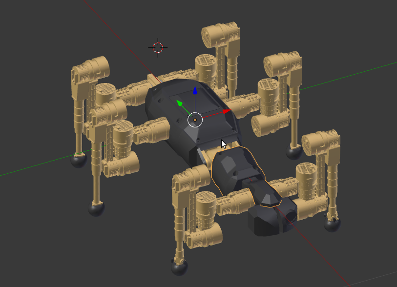

*The meshes are placed in correct relation to one another when exported as a group from CAD, however each part's origin is at the global origin of Blender.*

The origins of the individual parts can then be moved to the individual objects' center of mass (COM), center of geometry etc.:

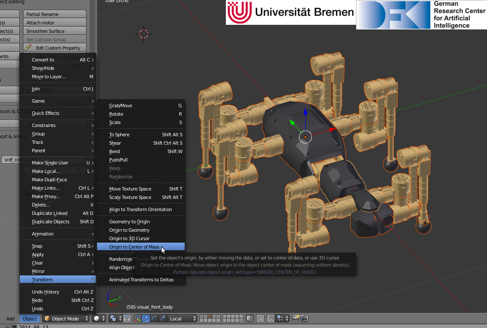

*Moving the origins of the objects to their approximated COM.*

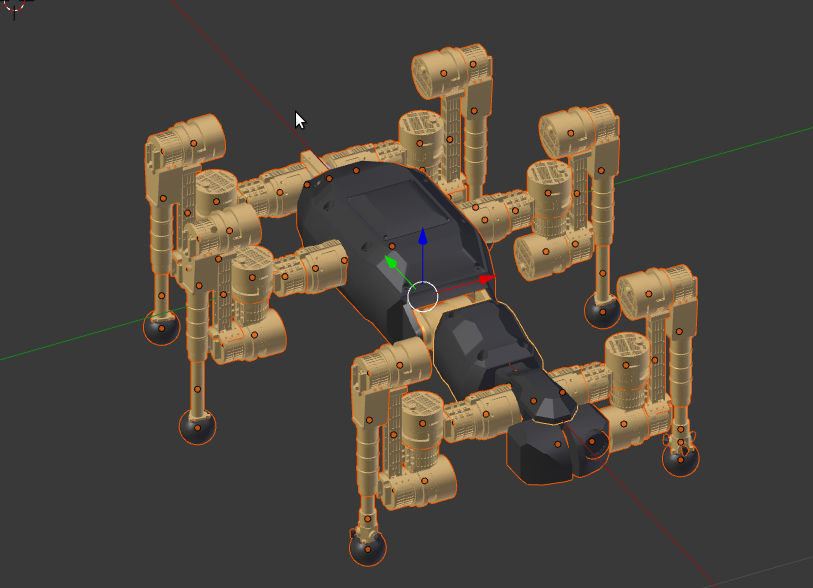
*Now every part has it's own origin, which will be important for adding collision objects etc.*

Note that the COM thus calculated of course assumes a homogenous mass distribution throughout the volume of a mesh, which will rarely be the case for real robots. To obtain a precise model, you will therefore at some point have to adjust the COM of the robot's parts (for which there is an operator, of course).
Another possibility is to export every part from CAD with the mesh's origin at the actual center of mass of that part (for which it is necessary to create coordinate systems in CAD residing at the COM). This however leads to the problem of then placing the individually exported parts correctly with respect to one another in blender. 
Either way, you can import the meshes of your choice by clicking clicking File -> Import -> \*, with \* being stl, obj etc.

For the purposes of this tutorial, we're not going to bother with a complex robot such as the [SpaceClimber](http://robotik.dfki-bremen.de/en/research/projects/spaceclimber-1.html), but instead a very simple walker we built from scratch:

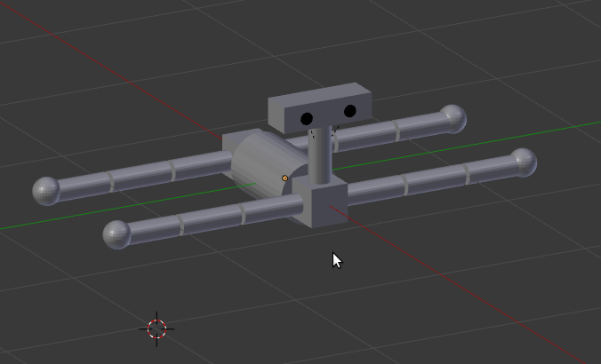

Our next step after the visuals are in place is to set the proper *phobostype* of our visuals. We can do this by selecting all visual objects and then using the *Set phobostype* operation from our Phobos toolbar. Choose *visual* for our visual objects. Make sure to "finish" the operator e.g. by hitting **A** again. Otherwise it will continue to be operating and undo the changes done before when you change your selection etc.

## Adding Links and Joints

Links and joints are handled as Blender armatures and bones in Phobos, as explained [elsewhere](editmodels.md). As stated before, it is entirely possible to position the 3D cursor at a specific location (**LMB** or 3D Cursor values displayed in the transform panel to the right of the 3D view), create a Blender armature and set the *phobostype* to 'link'. It's however easier to use Phobos' `Create Link(s)`  operator for that.

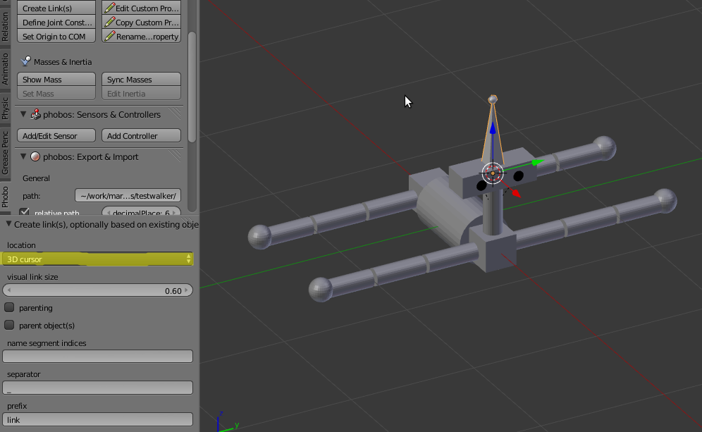

As you might have noticed, the operator can do more than simply place a link at the 3D cursor. For instance, you can select all visuals and choose `selected objects` for the 'location' in the operator. This will place links in the position and with the orientation of all selected visuals:

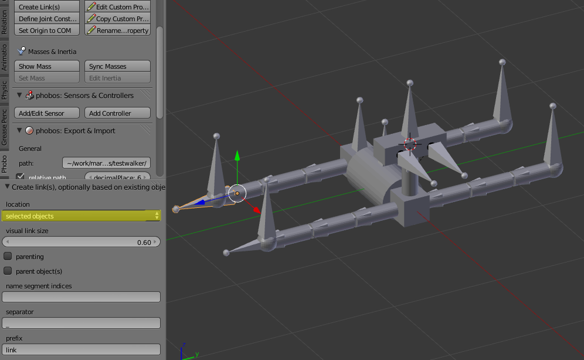

Now we could proceed parenting the bones to one another and the visuals to the respective bones using the `BONE_RELATIVE` parenting method. However, in our case, we have arranged our visuals in parent-child relationships already:

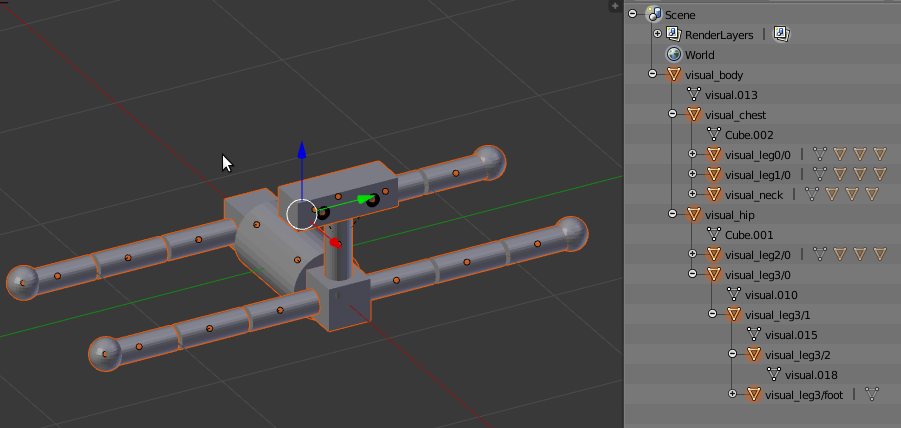

so that we can now mark both the `parenting` and `parent object(s)` options of the operator, set the indices (in the example, only one) of name parts that we would like to reuse to create names for our links and behold the robot structure unfold: 

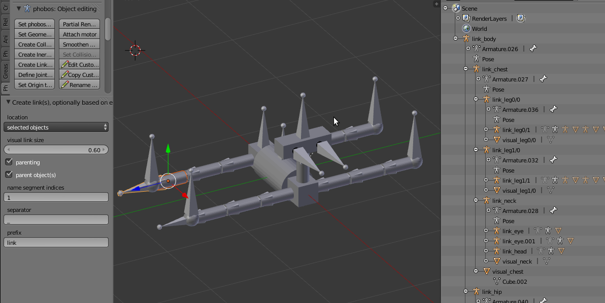

For the moment, we don't really want to have the 'link_' prefix, so we simply delete the field and get rid of that, but this of course depends on your own taste or needs for robot part nomenclature. Finish the operator by hitting **A**. As you will notice, all our newly-created bones are already set to *phobostype* 'link'.

## Constraints

So we have a robot skeleton with attached visuals now, but we have not really defined how the robot can move. For this, we have to fully define the joints. We have already implicitly defined the joints via the orientation of the links: most joints rotate around (or slide along) the long axis of the associated bone. If you select a bone, switch to *Pose Mode* and hit **R** twice to enter local rotating mode around Y, you can turn your joint around its axis:

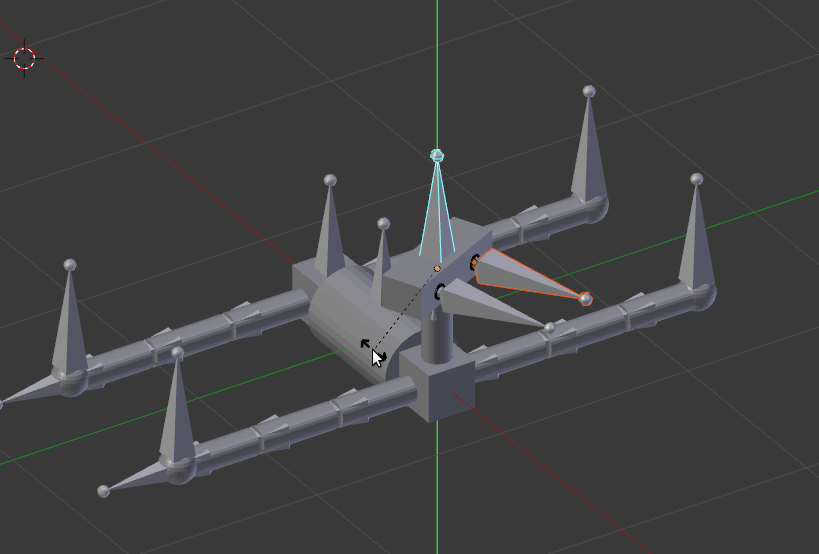

Note that the long axis of pose bones is always their local Y axis. That being said, let's restrict the head's movement by selecting the bone and start the `Define Joint Constraints` operator. We can the contraints defined in URDF and will witness the associated bone constraints being added to the bone object in Blender:

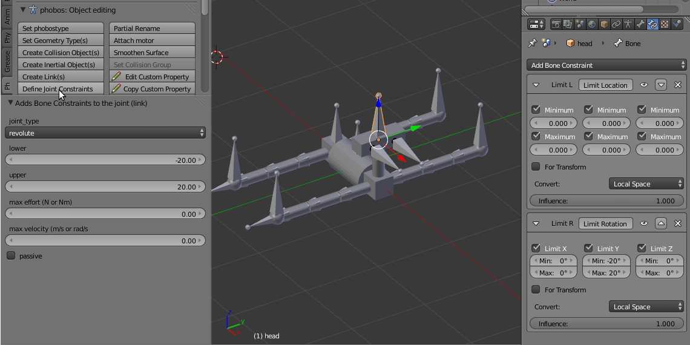

This will restrict the way *pose bone* can be rotated in Blender to the same degree as on the actual robot.

## Collision objects

After we've corrected the axis orientation on all the *edit bones* and set the joint constraints, we have completed the kinematic model of the robot. However, we also want to have objects representing collision in our model. Nothing simpler than that with the help of Phobos' `Create Collision Object(s)` operator. We start by selecting the *visual* of our robot's head, then execute the operator. Choosing the option 'box' for 'coll_type' and ending the operator will automatically place a box with the same dimensions as the visual on the layer for collision objects:

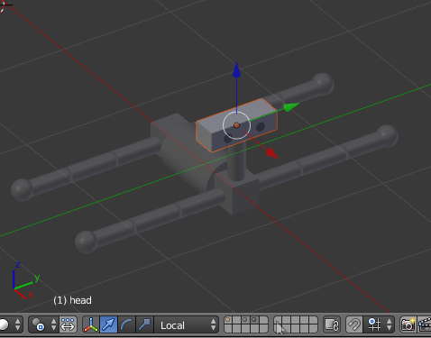

We can also select multiple objects and create automatically correctly oriented collision objects for them, for instance we could choose to represent the cylindric shapes of the body and legs with collision boxes for some reason

though 'cylinder' would surely be a more appropriate type here. Anyway, we can add the collision objects as necessary for our purposes and directly visually check if they are appropriately sized with repspect to the visuals. Of course the operator only allows to automate the process for simple shapes; if you have more complicated visuals, you should consider approximating them with a number of collision objects that you can create yourself, rotate and scale at will and parent (`BONE_RELATIVE`!) to the link as you please. Just make sure to enter the `geometry/type` properly in the custom properties of your custom collision objects and change the *phobostype* to 'collision'.

## Inertial objects

to do
