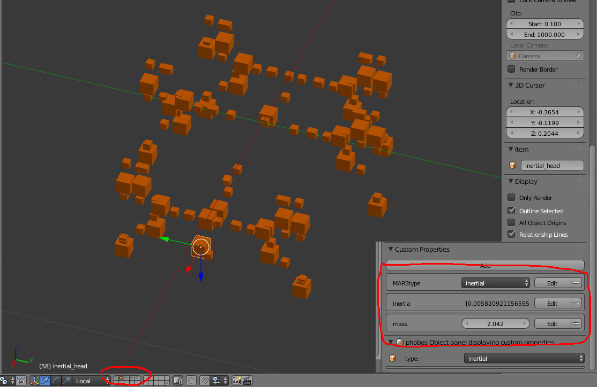
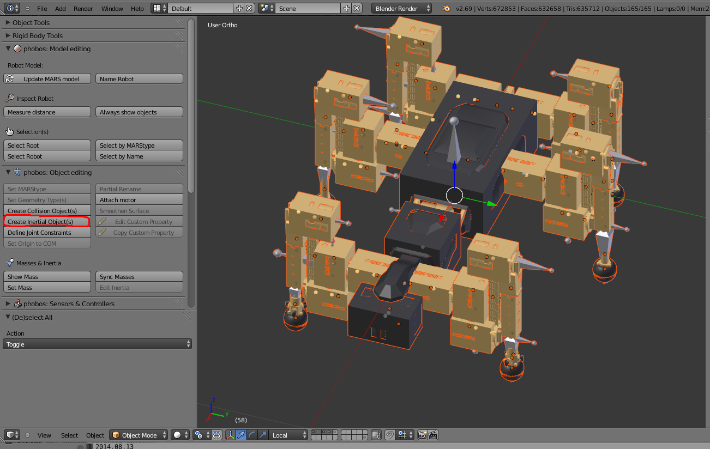
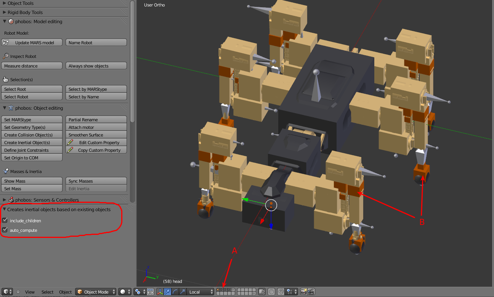
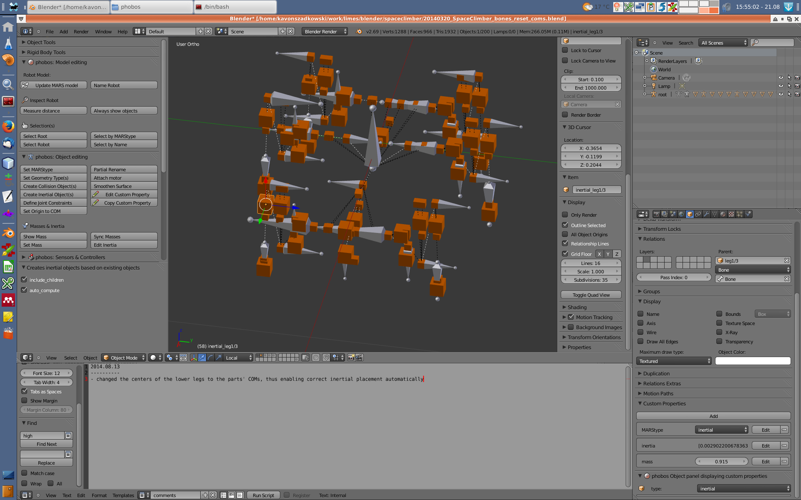

Working with Masses and Inertias {#phobos/tut:mass_inertia}
===================

There are two types of inertial objects, big ones and small ones. Small ones represent the inertial information of a visual or collision object, while big ones represent the inertia information that is integrated over the visual and collision objects of every link.

Inertials can be found on the second layer and their custom properties include 'phobostype', 'inertia' and 'mass'. phobostype shall always stay 'inertial' (and is set accordingly if inertial objects are created automatically). 'mass' is a float number representing the mass of an object (or link) in *kg*. 'inertia' is a list formatted as:

    [ixx, ixy, ixz, iyy, iyz, izz]

with 'i*' representing the upper half of a 3x3 inertia tensor. All these values are automatically calculated from the collision geometries (layer 4) of the model and the masses saved as custom properties in the respective objects. If the inertials should be recalculated, simply delete all inertial objects, then select all layers and click the "Create Inertial Object(s)" button on the left:

Upon execution of the operator, the derived inertial information will be used to create the inertial objects representing said information. It is possible to change the way the operator works by clicking on the options on the left:

If 'auto_compute' is activated, mass and inertia properties of the created objects will be automatically computed from the information in the model. 'include children' means that the inertial objects of the visual and collision elements are created and not only the inertials of the link (B). Thus it is possible to create all inertials and set the custom properties by hand, or to only create link inertials and type in their inertias which were derived from CAD. Make sure that all necessary layers are active, otherwise the operator will not be able to access the objects (A).

